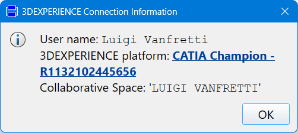
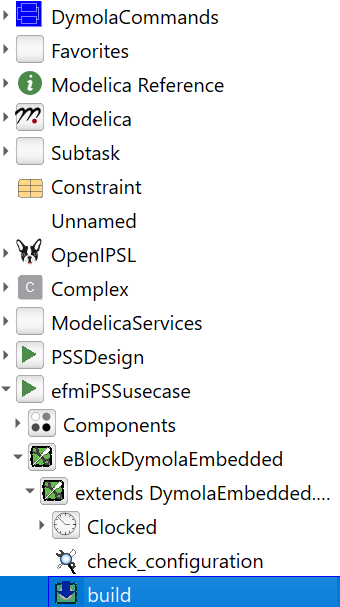
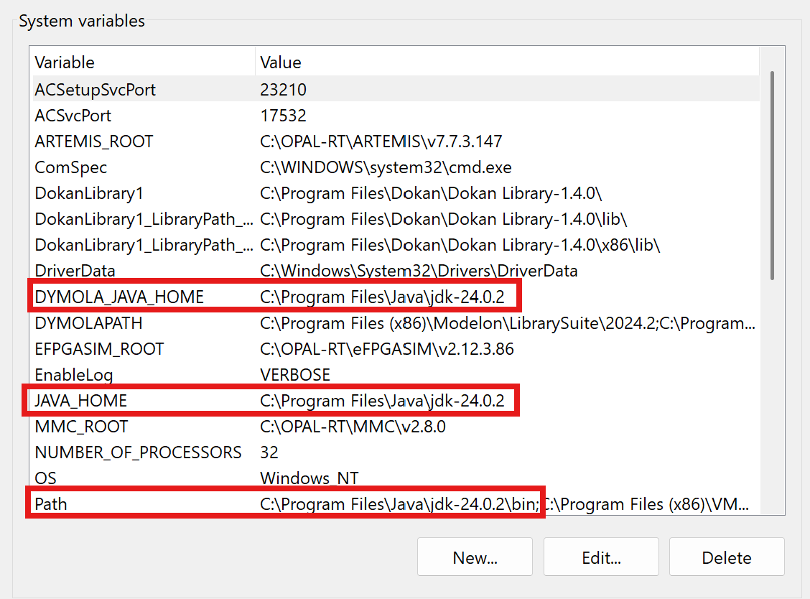

# efmi-pss-use-case
Models and resources for the application of eFMI to the use case of a power system stabilizer (i.e., damping control system).

## QuickStart
### A. Setup the environment and load the project files
1. Launch Dymola and connect to the 3DEXPERIENCE platform: ``Dymola > Tools > 3DEXPERIENCE > Connection``
    - If successful, your user name and information will be displayed in a new pop-up, similar to the one shown below: 
    
2. Load the OpenIPSL library from the linked dependency as described below.
3. Load the `PSSDesign` package, described below.
4. Load the `efmiPSSusecase` package, described below, this is the main package to be used.
5. Set the working directory. 
  - Note: the directory path should not be long, else, an error ``eFMU generation path exceeds max. path length limit`` can appear which requires to change the working directory. The default Dymola working directory is recommended.

### B. Build the eFMU
- Build the complete eFMU by executing the function ``efmiPSSusecase.eBlockDymolaEmbedded.build()``
    

- The generated files will be in the working directory. Within this repository, the files have been copied to ``./Modelica/eFMUs``


## Packages and Dependencies
### A. Linked Dependencies
- The latest version of OpenIPSL is already linked via sub-modules and can be found under ``./dependencies/OpenIPSL``
### B. Packages Required
Under ``./Modelica/`` the two required packages can be found:
- `PSSDesign` contains the power system models with different plant architectures that are extended to create the new model to test the `eBlock` with the generated `eFMU`.
- `efmiPSSusecase` contains the package with the modified PSS model to generate the `eBlock` and the `eBlock` inheriting from `DymolaEmbedded.EmbeddedConfiguration`.

### C. Shortcuts
Several shortcuts that call Modelica scripts to open the dependencies have been configured for different PCs and can be found under ``./Shortcuts``. You can copy and edit them to reuse them for your own machine.

## Requirements and TroubleShooting
The following should be available and adequately configurated 
- Ensure that that the 3DExperience account has been linked:
    - To verify call the function ``DymolaEmbedded.UsersGuide.Requirements.link_3DEXPERIENCE_account``
    - If not linked, call the function: ``DymolaEmbedded.UsersGuide.Requirements.link_3DEXPERIENCE_account``
    - The platform URL used for testing is: ``https://r1132102445656-eu1-ifwe.3dexperience.3ds.com/``

- Ensure that Java has been installed:
  - To install Java the OpenJDK JDK 24.0.2 was used:
    - Link to download: [https://jdk.java.net/24/](https://jdk.java.net/24/)
    - The contents of the .zip file, e.g., ``openjdk-24.0.2_windows-x64_bin.zip``, are uncompressed and pasted into the following Java installation directory:
    ``` C:\Program Files\Java\ ```
    - Verify that the path is now as follows:
    ```C:\Program Files\Java\jdk-24.0.2```
  - The following environment variables need have been configured and point to the Java installation root directory: ``DYMOLA_JAVA_HOME`` and ``JAVA_HOME``
  - Verify that the ``DYMOLA_JAVA_HOME`` variable has been set up propertly by going to: ``Dymola > Tools> Options> General``, under "Java runtime" the folder pointing to the Java installation directory should be listed.
  - The ``PATH`` environment variable needs to also point to the `./bin` directory within the Java installation folder:
    

### Build Issues
When attempting to build the eFMU, several issues were faced.
- Although Java appears to be properly installed and configured, the following error might appear when attempting to build the eFMU: see [here](./docs/excerpts/dymjavaerror01.md)
- While this is pointed as a Java error, testing in a different computer shows the following error: see [here](./docs/excerpts/dymbuilderror02.md).
