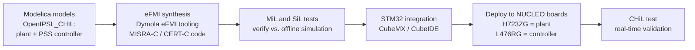
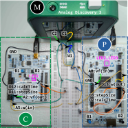

# efmi-pss-use-case

**Real-time simulation and Controller-Hardware-in-the-Loop (CHiL) testing of a Power System Stabilizer on low-cost microcontrollers, using Modelica and eFMI.**

[](./LICENSE) [](https://doi.org/10.5281/zenodo.20583549)

This repository is the open-source companion to the paper *"Real-time Simulation and CHiL Testing of Power System Stabilizers on Microcontrollers with Modelica and eFMI"* (American Modelica & FMI Conference, 2026). It provides an end-to-end, traceable workbench that takes a Power System Stabilizer (PSS) — a damping controller — and the power plant it regulates from physics-based Modelica models all the way to production code running on ARM Cortex-M microcontrollers, validated at every step.

---

## Overview

Modern grids increasingly suffer from poorly damped oscillations (e.g., the 2025 Iberian grid incident), which demand controllers that can be re-tuned and re-deployed throughout their lifecycle. Today, the path from a control design to a hardware test is slow and error-prone: offline tools like PSS®E or PSCAD® cannot run in real time, forcing manual re-implementation and breaking traceability between design and deployment.

This project demonstrates an automated alternative built on the [Modelica](https://modelica.org/language/) language and the [eFMI](https://www.efmi-standard.org/) (FMI for embedded systems) standard. Using Dymola's eFMI tooling, both the **controller** (the PSS) and the **plant** (a synchronous generator with its excitation control system, interconnected to a grid) are synthesized into MISRA C:2023 / SEI CERT C–compliant embedded code and deployed onto low-cost STM32 boards. The result is validated through a full suite of **Model-in-the-Loop (MiL)**, **Software-in-the-Loop (SiL)**, and **CHiL** tests, providing an open, traceable, and inexpensive alternative to proprietary real-time platforms.

The workflow is realized through a new Modelica library, **`OpenIPSL_CHIL`**, which extends the [Open-Instance Power System Library (OpenIPSL)](https://github.com/OpenIPSL/OpenIPSL) for embedded real-time applications.

### Workflow at a glance


```mermaid
flowchart LR
  A["Modelica models<br/>OpenIPSL_CHIL:<br/>plant + PSS controller"] --> B["eFMI synthesis<br/>Dymola eFMI tooling<br/>MISRA-C / CERT-C code"]
  B --> C["MiL and SiL tests<br/>verify vs. offline simulation"]
  C --> D["STM32 integration<br/>CubeMX / CubeIDE"]
  D --> E["Deploy to NUCLEO boards<br/>H723ZG = plant<br/>L476RG = controller"]
  E --> F["CHiL test<br/>real-time validation"]
```

> [!WARNING]
> **This is a large repository (~750 MB of Git history, ~800 MB checked out).** By design, it ships generated reproducibility artifacts — the SiL FMUs and the MiL/CHiL simulation results behind the paper's figures — so the models *and* the evidence for the paper's claims travel together. If you only want to read and run the models, clone a **shallow snapshot** to skip the history and avoid the large download:
>
> ```bash
> git clone --depth 1 --recurse-submodules --shallow-submodules \
>   https://github.com/ALSETLab/efmi-pss-use-case.git C:/dev/efmi-pss-use-case
> ```
>
> A full clone (with complete history) is only needed if you intend to contribute changes.
>
> **Windows users:** clone into a short root path such as `C:\dev\` (as above). The eFMI build generates deeply nested file paths, and cloning under a long location (e.g. `C:\Users\<you>\Documents\...`) will hit the Windows 260-character `MAX_PATH` limit and cause build failures.

## Repository structure

| Path | Contents |
| --- | --- |
| [`Modelica/OpenIPSL_CHIL/`](./Modelica/OpenIPSL_CHIL) | The `OpenIPSL_CHIL` Modelica library — the heart of the project (see below). |
| [`dependencies/openipsl/`](./dependencies) | [OpenIPSL](https://github.com/OpenIPSL/OpenIPSL) library, linked as a git submodule. |
| [`STM32/`](./STM32) | STM32CubeIDE firmware projects that integrate the generated eFMI code for the plant and controller boards. |
| [`MATLAB-Analysis/`](./MATLAB-Analysis) | MATLAB scripts for PSS redesign, CHiL-setup simulations, and experiment comparisons. |
| [`Waveforms/`](./Waveforms) | Digilent WaveForms capture projects and recorded data (Analog Discovery 3) from the experiments, including the figures reproduced in the paper. |
| [`Shortcuts/`](./Shortcuts) | One-click Dymola launcher (`DoubleClickAndRunDymolaScript.cmd`) and startup script (`startup-generic.mos`) that load OpenIPSL, the library, and the generated artifacts. |
| [`docs/`](./docs) | Images and troubleshooting notes referenced from this README. |

### The `OpenIPSL_CHIL` library

`OpenIPSL_CHIL` ("Extensions of OpenIPSL for embedded real-time applications") is organized into:

- **`Components`** — OpenIPSL components modified for embedded deployment, plus new ones. The `PSS` sub-package holds the controller variants, their building blocks, and the eFMU generation configurations; `Auxiliary` and `Machines` hold the modified line, fault, and machine models; `Tests` provides unit tests for the continuous, clocked, and eFMU variants.
- **`Generator`** — variants of the generator unit (machine + excitation control system) for the successive stages of control design, redesign, and embedded integration.
- **`Network`** — variants of the grid *without* the generator unit, used to assemble simulation and eFMU-export models.
- **`RTS`** — plant models targeted at real-time simulation (HiL and CHiL), including their eFMU generation configurations.
- **`Examples`** — the MiL experiments, e.g. under `Examples.CHIL_Configuration.Grid4CHIL`.

## Requirements

**Software**

- **Dymola 2026x Refresh 1** (the version tested; also the launcher's default) with the **eFMI / Embedded** toolchain and a **Source Code Generation** license. With this license, eFMI code generation runs **fully locally** — this is the recommended setup. Running the generation against the **3DEXPERIENCE / SOP** platform is supported but **no longer required**.
- **OpenIPSL 3.1.0** — included as a submodule under `dependencies/openipsl`.
- **Modelica Standard Library 4.0.0**, **Complex 4.0.0**, **Modelica_LinearSystems2 3.0.1**, **DymolaEmbedded 1.0.5** (shipped with / installed alongside Dymola).
- **Java** — OpenJDK **24.0.2** ([download](https://jdk.java.net/24/)), with `JAVA_HOME` and `DYMOLA_JAVA_HOME` set to the JDK root and the JDK `bin` on `PATH` (required by the eFMI toolchain).
- **STM32CubeMX** (tested with 6.17.0) and **STM32CubeIDE** (tested with 2.1.0) for building and flashing the embedded firmware.
- **MATLAB** for the PSS redesign and analysis scripts.

**Hardware (for CHiL)**

- **NUCLEO-H723ZG** — runs the *plant* model (12-bit DAC, 0–3.3 V).
- **NUCLEO-L476RG** — runs the *controller* (PSS).
- A breadboard and patch wires to interconnect the analog I/O of the two boards.
- **A data-recording instrument** to capture the closed-loop signals during the experiments. We suggest the **Digilent Analog Discovery 3** (used in the paper), but any oscilloscope or data-acquisition device with comparable bandwidth and resolution works. The corresponding [Digilent WaveForms](https://digilent.com/reference/software/waveforms/waveforms-3/start) capture projects are provided under [`Waveforms/`](./Waveforms).

The CHiL experimental setup and signal path used in the paper — the controller and plant NUCLEO boards interconnected, with the Analog Discovery 3 recording the signals:



## Getting started

### 1. Clone with submodules

OpenIPSL is linked as a submodule, so clone recursively (or use the lighter shallow clone shown in the note above):

```bash
git clone --recurse-submodules https://github.com/ALSETLab/efmi-pss-use-case.git
```

If you already cloned without `--recurse-submodules`, run:

```bash
git submodule update --init --recursive
```

### 2. Load the models in Dymola

**Option A — automated launcher (recommended).** Just double-click `Shortcuts/DoubleClickAndRunDymolaScript.cmd`. It resolves the repository root from its own location, auto-detects your Dymola installation, regenerates `load_artifacts.mos` from `.gitignore`, launches Dymola, and runs `startup-generic.mos` — loading OpenIPSL, the `OpenIPSL_CHIL` library, and the generated artifacts, then setting the working directory to `Modelica/work`. No paths to configure.

**Option B — manual.**

1. Open `dependencies/openipsl/OpenIPSL/package.mo` to load OpenIPSL.
2. Open `Modelica/OpenIPSL_CHIL/package.mo` to load the library.
3. Set the repository's [`Modelica/work`](./Modelica/work) folder as the Dymola working directory (Option A's launcher does this for you). Keeping the working directory inside the repo also keeps paths short, avoiding the `eFMU generation path exceeds max. path length limit` error.

> [!NOTE]
> `Modelica/work` already contains the generated eFMUs, SiL tests, and FMUs that ship with the repository. If you regenerate artifacts there, your build may overwrite or damage these committed files — that's expected. You can always discard your local changes (`git checkout -- Modelica/work` / `git restore Modelica/work`) and pull our artifacts again.

### 3. Generate an eFMU

The eFMU generation configurations live next to the models they target — for example, the controller configuration `OpenIPSL_CHIL.Components.PSS.eFMUs.PSSTypeIISimpleHPF`, which extends `DymolaEmbedded.EmbeddedConfiguration` (model `PSSTypeIISimpleHPF`, 0.2 ms sample period, Explicit Euler solver). Open the desired configuration and build it with Dymola's eFMI tooling.

> [!NOTE]
> Generating eFMUs requires the Dymola **Source Code Generation** license. If you don't have it, you don't need to generate anything — the eFMUs and their production code that we generated are already included in the repository under [`Modelica/work`](./Modelica/work) (loaded automatically by the launcher), so you can inspect and run the artifacts directly.

### 4. Run the tests

- **MiL** — open the experiments under `OpenIPSL_CHIL.Examples.CHIL_Configuration.Grid4CHIL` and simulate.
- **SiL** — use the `SiLTest` models under `Components/PSS/eFMUs/*` (and the corresponding plant configurations) to verify the generated eFMI production code against the offline simulations.
- **CHiL** — flash the firmware from `STM32/` to the two NUCLEO boards, wire them together, and reproduce the experiments; analyze the captured `Waveforms/` with the scripts in `MATLAB-Analysis/`.

## Troubleshooting

*Only if you use the optional 3DEXPERIENCE / SOP path:* if the account is not linked, call `DymolaEmbedded.UsersGuide.Requirements.link_3DEXPERIENCE_account`; see also the [3DEXPERIENCE SPE documentation](https://help.3ds.com/2026x/English/DSDoc/CatEspUserMap/catesp-c-ov.htm?contextscope=cloud&id=27ed9a2adbe54e61aa477c3d4a7d8433).

## How to cite

If you use these models or the workflow, please cite:

> L. Vanfretti, C. Bürger, J. Pizzimenti, K. R. Wilt, and H. Chang, "Real-time Simulation and CHiL Testing of Power System Stabilizers on Microcontrollers with Modelica and eFMI," *American Modelica & FMI Conference*, 2026.

```bibtex
@inproceedings{Vanfretti2026_eFMI_PSS,
  author    = {Vanfretti, Luigi and B{\"u}rger, Christoff and Pizzimenti, Joseph and Wilt, Kyle R. and Chang, Hao},
  title     = {Real-time Simulation and {CHiL} Testing of Power System Stabilizers on Microcontrollers with {Modelica} and {eFMI}},
  booktitle = {American Modelica \& FMI Conference},
  year      = {2026}
  % TODO: add pages / DOI once available
}
```

## License

Released under the 3-Clause BSD License. Copyright © 2025–2026, ALSETLab and Dassault Systèmes. See [`LICENSE`](./LICENSE).

## Authors and acknowledgments

Developed by [ALSETLab](https://github.com/ALSETLab), Rensselaer Polytechnic Institute, in collaboration with Dassault Systèmes:
Luigi Vanfretti, Christoff Bürger (Dassault Systèmes), Joseph Pizzimenti, Kyle R. Wilt, and Hao Chang.

This work was made possible by the generous support of:

- The **CATIA Champions** program at Dassault Systèmes — and in particular **Fabio Ballari** (CATIA Champions Program Manager) — for providing complimentary access to the 3DEXPERIENCE platform and its Software Production Engineering (SPE/SOP) service, which enabled the early development of this work.
- **Dr. Christopher R. Laughman** (Senior Team Leader, Multiphysical Systems, Mitsubishi Electric Research Laboratories — MERL) for an unrestricted gift grant to Rensselaer Polytechnic Institute that funded the embedded hardware behind this project, including the STM32 NUCLEO boards (both those used in the paper and others evaluated along the way) and the Analog Discovery 3 instrumentation.
