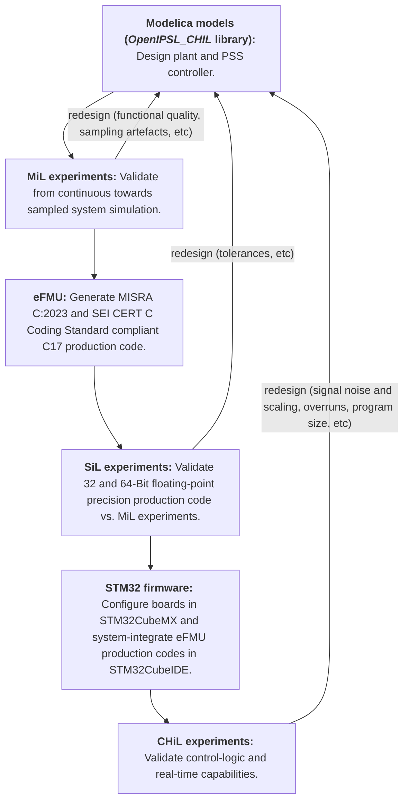
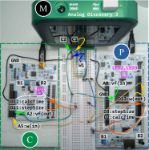

**Real-time simulation and controller-hardware-in-the-loop (CHiL) testing of power system stabilizers (PSS) on low-cost microcontrollers with Modelica and eFMI.**

[](./LICENSE) [](https://doi.org/10.5281/zenodo.20583549)

*Repository archived on Zenodo — DOI: [10.5281/zenodo.20583549](https://doi.org/10.5281/zenodo.20583549)*


_**Top left & bottom right:** Modelica model & derived eFMI STM32 firmware in Dymola & STM32CubeIDE; **Bottom left & top right:** MiL simulation of CHiL setup & actual measurements in Digilent WaveForms._

This repository is the open-source companion to the paper *"Real-time Simulation and CHiL Testing of Power System Stabilizers on Microcontrollers with Modelica and eFMI"*, accepted at the [American Modelica & FMI Conference 2026](https://modelica.org/events/american2026/) (a [pre-print is available on ResearchGate](https://www.researchgate.net/publication/406308854_Real-time_Simulation_and_CHiL_Testing_of_Power_System_Stabilizers_on_Microcontrollers_with_Modelica_and_eFMI)). It provides an end-to-end, traceable workbench that takes a power system stabilizer (PSS) — a damping controller — and the power plant it regulates from physics-based Modelica models all the way to production code running on ARM Cortex-M microcontrollers, validated at every step.

> [!WARNING]
> **Microsoft Windows users should clone into a short root path.** Generated artefacts have deeply nested file paths; cloning under a long location will hit the `MAX_PATH` limit and cause build failures.

> [!WARNING]
> **This is a large repository.** It ships generated, reproducibility artifacts — the eFMUs, and SiL/MiL/CHiL simulation results — so the models *and* the evidence for the paper's claims travel together.

> [!TIP]
> If you only want to read and run the models, clone a **shallow snapshot** via:
> ```bash
> git clone --depth 1 --recurse-submodules --shallow-submodules \
>   https://github.com/ALSETLab/efmi-pss-use-case.git C:/dev/efmi-pss-use-case
> ```

---

# Overview

Modern grids increasingly suffer from poorly damped oscillations (e.g., the [2025 Iberian grid incident](https://www.entsoe.eu/publications/blackout/28-april-2025-iberian-blackout/)), which demand controllers that can be re-tuned and re-deployed throughout their lifecycle. Today, the path from a control design to a hardware test is slow and error-prone: offline tools like [PSS/E](https://www.siemens.com/en-us/products/pss-software/gridscale-x-pss-e/) or [PSCAD](https://www.pscad.com/) cannot run in real time, forcing manual re-implementation and breaking traceability between design and deployment.

This project demonstrates an automated alternative built on the [Modelica](https://modelica.org/) language and the [eFMI](https://www.efmi-standard.org/) (FMI for embedded systems) standards. Using the eFMI tooling of [Dymola](https://www.dymola.com), both the **controller** (a power system stabilizer (PSS)) and the **plant** (a synchronous generator with its excitation control system, interconnected to a grid) are synthesized into [MISRA C:2023](https://misra.org.uk/) and [SEI CERT C Coding Standard](https://cmu-sei.github.io/secure-coding-standards/sei-cert-c-coding-standard/) compliant, safety-critical and hard-real time suited, embedded code, deployable onto low-cost [STM32](https://www.st.com/en/microcontrollers-microprocessors/stm32-32-bit-arm-cortex-mcus.html) boards. The result is validated through a full suite of **Model-in-the-Loop (MiL)**, **Software-in-the-Loop (SiL)**, and **Controller-Hardware-in-the-Loop (CHiL)** experiments, providing an open, traceable, and inexpensive alternative to proprietary real-time platforms.

The design of PSS and plant models is organized in a new Modelica library, **`OpenIPSL_CHIL`**, which extends the well-established [Open-Instance Power System Library (OpenIPSL)](https://github.com/OpenIPSL/OpenIPSL) to be suited for embedded real-time applications. Starting from the physics-equations based PSS and plant models of `OpenIPSL_CHIL`, eFMI and STM32Cube tooling enable a more or less automatic model based software engineering (MBSE) from Modelica models to microcontroller firmware, as shown in the following workflow diagram:


```mermaid
flowchart TD
  A["`**Modelica models (_OpenIPSL_CHIL_ library):** Design plant and PSS controller.`"] --> B["`**MiL experiments:** Validate from continuous towards sampled system simulation.`"]
  B -- redesign (functional quality, sampling artefacts, etc) --> A
  B --> C["`**eFMU:** Generate MISRA C:2023 and SEI CERT C Coding Standard compliant C17 production code.`"]
  C --> D["`**SiL experiments:** Validate 32 and 64-Bit floating-point precision production code vs. MiL experiments.`"]
  D -- redesign (tolerances, etc) --> A
  D --> E["`**STM32 firmware:** Configure boards in STM32CubeMX and system-integrate eFMU production codes in STM32CubeIDE.`"]
  E --> F["`**CHiL experiments:** Validate control-logic and real-time capabilities.`"]
  F -- redesign (signal noise and scaling, overruns, program size, etc) --> A
```

# Repository structure

| Path | Contents |
| --- | --- |
| [`models`](./models) | The `OpenIPSL_CHIL` Modelica library — the heart of the project (see below); and a git submodule for the `OpenIPSL` library. `./models/start-Dymola.bat` is a one-click Windows script that launches Dymola, preconfigures its working directory and loads all required Modelica libraries -- like `OpenIPSL` and `OpenIPSL_CHIL` -- and the generated artifacts like eFMUs, eFMU SiL-stubs, eFMU production code based source code FMUs, etc. |
| [`firmware/`](./firmware) | STM32CubeIDE and STM32CubeMX projects for developing the STM32 microcontroller firmware for PSS and plant based on generated eFMI production codes. |
| [`measurements/`](./measurements) | Digilent WaveForms capture projects and recorded data of CHiL experiments; includes predefined setups to conduct the measurements required for the paper figures using the Analog Discovery 3 oscilloscope (i.e., to reproduce the CHiL experiments like computation time analyses). |
| [`postprocessing/`](./postprocessing) | MATLAB scripts for analyses of MiL, SiL and CHiL experiments, for example, analyses of PSS redesign simulations, CHiL-setup simulations, and actual CHiL measurements. |
| [`documentation/`](./documentation) | Accompanying documentation of used hardware and tooling, the pin-configuration of the CHiL setup, etc. |

## The `OpenIPSL_CHIL` library

`OpenIPSL_CHIL` (OpenIPSL for CHiL: Extensions of OpenIPSL for embedded real-time applications) is organized into:

- **`Components`:** OpenIPSL components modified for embedded deployment, alongside new components stemming from additional embeeded domain requirements. The `PSS` sub-package holds the controller variants, their building blocks, and the eFMU generation configurations; `Auxiliary` and `Machines` encapsulate modified variants of OpenIPSL transmission line, fault, and machine models that required adaptations to be suited for the embedded, hard real-time domain; `Tests` provides unit tests for component models, including continuous, clocked, and eFMU PSS variants.
- **`Generator`:** Variants of the generator unit (machine + excitation control system) for the successive stages of control design, redesign, and embedded integration.
- **`Network`:** Variants of the grid *without* the generator unit, used to assemble simulation and eFMU export models.
- **`RTS`:** Plant models targeted at real-time simulation (HiL and CHiL), including their eFMU generation configurations.
- **`Examples`:** Whole system experiments with closed-loop PSS controller and plant for offline simulations from continuous, toward sampled system and eventually expected final CHiL setup behavior (MiL and SiL).

# Requirements

## Software

- **[Dymola](https://www.dymola.com) 2026x Refresh 1** with **Dymola Source Code Generation License**: Required for eFMI code generation (GALEC code of Algorithm Code container and derived C17 code of Production Code container). For requirement details, please consult the documentation of `DymolaEmbedded.UsersGuide.Requirements` of the `DymolaEmbedded` library shipped with Dymola.
- **[Java](https://www.java.com/en/) 21**: Required by Dymola's eFMI tooling. For the paper we used the portable (i.e., zip, not MSI installer) [Eclipse Temurin JDK 21.0.11+10](https://adoptium.net/temurin/releases/) unpacked in its default installation directory (`C:\Program Files\Java\jdk-21.0.11+10` in Windows).
- **[STM32CubeMX](https://www.st.com/en/development-tools/stm32cubemx.html) 6.17.0** and **[STM32CubeIDE](https://www.st.com/en/development-tools/stm32cubeide.html) 2.1.0**: Required for pin and timer configuration, generation of STM32 hardware abstraction layer (HAL) integration code, firmware development and final flashing on SMT32 boards.
- **[Digilent WaveForms](https://digilent.com/shop/waveforms/) 3.25.1** (if the Analog Discovery 3 oscilloscope is used, cf. hardware below): Required to visualize and store measurements of the CHiL experiments.
- **[MATLAB](https://www.mathworks.com/products/matlab.html)**: Required to postprocess experiment results.

Optional for production code analyses based on the strict configuration profiles provided by Dymola (cf. `DymolaEmbedded.EmbeddedConfiguration.ProductionCode.check_codes()`):

- **[Cppcheck Premium](https://www.cppcheck.com/) 26.3.0**: To check MISRA C:2023 and SEI CERT C Coding Standard compliance, and for general bugs, undefined behavior and dangerous coding constructs.
- **[Python](https://www.python.org/) 3.14** and **[Pygments](https://pygments.org/)**: Required by Cppcheck Premium for HTML reports. Python needs to be in its default installation directory (e.g., `C:\Users\<<your user name>>\AppData\Local\Programs\Python\Python314` in Windows).
- **[clang-tidy](https://clang.llvm.org/extra/clang-tidy/) (Clang Tools 19.1.5)**: To check general code quality.

## Hardware (for CHiL experiments)

- **[NUCLEO-H723ZG](https://www.st.com/en/evaluation-tools/nucleo-h723zg.html)**: Runs the *plant* model.
- **[NUCLEO-L476RG](https://www.st.com/en/evaluation-tools/nucleo-l476rg.html)**: Runs the *controller* (PSS).
- **Breadboard and patch wires**: To interconnect the analog I/O of the two boards.
- **A data-recording instrument**: To capture the closed-loop signals during the CHiL experiments. We suggest the [Analog Discovery 3](https://digilent.com/shop/analog-discovery-3/) used in the paper, but any oscilloscope or data-acquisition device with comparable bandwidth and resolution works.

# Workflow

The following step-wise workflow generates all artifacts of the paper's (cf. next section) controller and plant CHiL setup from scratch, accompanied by respective MiL, SiL, and CHiL experiments. It sketches the general tasks and artifacts involved when using the workbench to design new damping controllers and plant models for microcontroller deployment. For a better general introduction of the workflow and involved tooling, please consult our paper.

> [!NOTE]
> The repository already ships with generated eFMUs, eFMU SiL-stubs, SiL experiments, and eFMU production code based source code FMUs; all under `./models/working-directory`. Likwise, the respository already provides firmware projects with the eFMU production code system integrated into the STM32 HAL for the board configurations of the paper; all under `./firmware/`.

> [!WARNING]
> If artifacts are (re)generated, the existing ones are overwritten! If anything goes wrong, you can always discard your local changes; if you do not intend to commit new versions, just build on a local git branch.

> [!NOTE]
> Steps 2-5 can be skipped if one just wants to conduct the CHiL experiments with the models as they are. But building and flashing of the firmware as described from step 6 is still required since binaries are not shipped with the repository.

> [!NOTE]
> If only interested in offline design and MiL experiments, only Steps 1-4 are relevant.

## 1. Clone repository with submodules

OpenIPSL is linked as a submodule, so clone recursively (or use a lighter shallow clone as explained in the tip at the beginning):

```bash
git clone --recurse-submodules https://github.com/ALSETLab/efmi-pss-use-case.git
```

If you already cloned without `--recurse-submodules`, run:

```bash
git submodule update --init --recursive
```

## 2. Load models in Dymola

**Option A — automated launcher (recommended):** Just double-click `./models/start-Dymola.bat`.

**Option B — manual:**

1. Start Dymola.
2. Set Dymola's working directory to `./models/working-directory`.
3. Load the `OpenIPSL` library from `./models/OpenIPSL-submodule/OpenIPSL/`.
4. Load the `OpenIPSL_CHIL` library from `./models/OpenIPSL_CHIL/`.
5. Load eFMU SiL-stubs by executing `.DymolaEmbedded_menu.load_all("OpenIPSL_CHIL")` (can also be done via: _Tools_ ribbon -> eFMI® button -> Load eFMU Co-simulation Stubs... -> select the library as `package_name` using the selection dialog opened via the directory-tree button).

## 3. Generate eFMUs in Dymola

The eFMU generation configurations live next to the models they target — for example, the configuration for the controller is `OpenIPSL_CHIL.Components.PSS.eFMUs.PSSTypeIISimpleHPF` and for the plant it is `OpenIPSL_CHIL.RTS.CHIL.eFMUs.Grid4CHIL`. To build a configuration's eFMU from scratch, just call its `build()` function with `update=false` and `build_binary_stub=true`. To investigate a generated eFMU the `browse_code()` function can be used.

## 4. Mil and SiL experiments in Dymola

Designing PSS controllers for microcontroller deployment, and real-time capable power system plant models that can be used to CHiL test PSS designs, is a step-wise refinement process from continuous towards hybrid continuous-sampled simulations, from open-loop unit tests towards closed-loop whole system simulations. The `OpenIPSL_CHIL` library contains experiments covering the whole design process:

 - Unit tests for different PSS designs (subpackages of `OpenIPSL_CHIL.Tests.PSS`).
 - For each PSS design, a continuous, sampled, and eFMU SiL-stub based unit test (e.g., `PSSTypeIISimpleHPF`, `PSSTypeIISimpleHPF_Clocked`, and `PSSTypeIISimpleHPF_eFMU` experiments).
 - Likwise, open-loop plant tests from continuous towards eFMU SiL-stub based (`OpenIPSL_CHIL.RTS.Tests.CHIL` package, `Grid4CHIL`, `Grid4CHIL_Clocked` and `Grid4CHIL_eFMU` experiments).
 - Whole system tests, from continuous towards sampled CHiL setup (`OpenIPSL_CHIL.Examples.CHIL_Configuration.Grid4CHIL` package, `ReferenceSetup*` experiments), and actual cyber-physical system behavior simulation with sampled controller and continuous plant (`RefSim_ClockedPSS_CT_Plant` experiment).
 - SiL tests derived from MiL tests (aligned with their respective eFMU generation configuration, e.g., `OpenIPSL_CHIL.Components.PSS.eFMUs.PSSTypeIISimpleHPF.SiLTest`).

> [!NOTE]
> It is important to be aware that refined experiments -- for example to introduce PSS sampling -- typically caused redesigns of components and/or design iterations -- for example unacceptable sampling artifacts can be compensated by decreasing sampling periods, requiring in turn parameter adjustments of input signal filters. Of course, each redesign requires another revalidation of previous experiments. Although the experiments of the `OpenIPSL_CHIL` library reflect the different development steps towards embedded application, the actual iterative development is not; the PSS and plant model designs of `OpenIPSL_CHIL` are final, and the history of intermediate designs -- and therefore the contribution of accompanying MiL to SiL experiments for the design process, justifying their need -- is lost.

## 5. Firmware development in STM32CubeMX and STM32CubeIDE

Actual firmware, running the eFMU production code generated for a certain `OpenIPSL_CHIL` model on a certain STM32 board, is developed in subdirectories of `./firmware/`. Each subdirectory is named after the `OpenIPSL_CHIL` model its firmware is based on and the development board it targets; and suffixed `_FP64` if the 64-Bit floating-point precision production code is used instead of the default 32-Bit. For example, `./firmware/Grid4CHIL_H723ZG_FP64/` denotes the 64-Bit floating-point precision production code of the `OpenIPSL_CHIL.RTS.CHIL.eFMUs.Grid4CHIL` eFMU generated for the `OpenIPSL_CHIL.RTS.CHIL.Grid4CHIL` plant model targeting a NUCLEO-H723ZG.

Each `./firmware/` subdirectory is a STM32CubeIDE project for developing the respective firmware; the project itself has been initially created by the STM32CubeMX configuration at its root (`*.ioc` files named like the targetted microcontroller). STM32CubeMX generated the initial STM32 hardware abstraction layer (HAL) integration code configuring the clock tree, pins, timers, etc. The eFMU production code simply is symbolically linked as source and include directories (e.g., `../../models/working-directory/Grid4CHIL/eFMU/PCode_SPE_fba3e0dfa6c8985b41bcbe3594ee941ce98b740c` for the `Grid4CHIL_H723ZG_FP64` firmware project); its integration within the STM32CubeMX-generated control-loop of the `main()` execution routin is handwritten as described in the paper.

## 6. Import, build, and deploy firmware projects in STM32CubeIDE

To import a firmware project of the `./firmware` directory (cf. Step 5) in a STM32CubeIDE workspace, use _File_ menu -> _STM32 Project Create/Import_ -> _Import STM32 Project_ -> _STM32CubeMX1/STM32CubeIDE Project_ -> select the respective `./firmware` subdirectory via _Directory..._ -> check the _Folder_ checkbox (make sure _Detect and configure project natures_ is checked).

> [!WARNING]
> The STM32CubeIDE workspace is _not_ part of the repository -- only projects are. Any directory not within the repository can be used as workspace (never push your workspace directory by accident).

> [!TIP]
> When developing a new firmware -- i.e., not just importing any of the existing STM32CubeIDE projects -- the generated eFMU production code still has to be symbolically linked and system-integrated in the control-loop of the `main()` execution routin (cf. Step 5). Likewise, build options have to be configurated. Any of the existing projects can be used as template to this end; the general approach always is more or less the same. 

To build the firmware, use _Project_ menu -> _Build All_ (make sure the _Release_ build is active: _Project_ menu -> _Build Configurations_ -> _Set Active_).

To flash the firmware, use _Run_ menu -> _Run As_ -> _STM32 C/C++ Application_ -> select the _Release_ build elf in _Qualifiers_ -> _Ok_ -> _Debugger_ tab -> check _ST-LINK S/N_ and use _Scan_ to find all connected boards -> pick the right board based on its serial number (typically printed on a sticker on the board).

## 7. Conduct CHiL experiments in WaveForms

The signal path of the CHiL experimental setup of the paper is (_C_ is the controller board, _P_ the plant board):



1. Wire the boards and Analog Discovery 3 as shown in the picture above (signal path).
3. Flash the controller firmware in `./firmware/PSSTypeIISimpleHPF_L476RG/Release/PSSTypeIISimpleHPF_L476RG.elf` on the NUCLEO-L476RG (cf. Setp 6).
2. Flash the plant firmware in `./firmware/Grid4CHIL_H723ZG/Release/Grid4CHIL_H723ZG.elf` on the NUCLEO-H723ZG (cf. Setp 6).
4. Reset both boards via the reset button.
5. Conduct measurements in Digilent WaveForms using the capture projects in `./measurements/*`. Remember that sustained fault injection via the _B1_ button will cause the plant to destabilize beyond recovery; if that happens, plant _and_ controller need to be reset via their _B2_ buttons. Likewise, with the PSS controller disengaged the plant cannot compensate injected faults (the _B1_ button disengages/enagages the controller). See the paper for details.
6. Analyze captured results using the MATLAB scripts in `./postprocessing/*`.

# Original authors and how to cite

Originally developed by [ALSETLab](https://github.com/ALSETLab), [Rensselaer Polytechnic Institute](https://www.rpi.edu/), in collaboration with [Dassault Systèmes](https://www.3ds.com/) by Luigi Vanfretti, Christoff Bürger, Joseph Pizzimenti, Kyle R. Wilt, and Hao Chang, and released under the [3-Clause BSD License](https://opensource.org/license/BSD-3-clause) with _Copyright © 2025–2026, ALSETLab and Dassault Systèmes_.

If you use these models or the workflow, please cite our original paper ([DOI: 10.13140/RG.2.2.32454.84808](https://doi.org/10.13140/RG.2.2.32454.84808); [ResearchGate link](https://www.researchgate.net/publication/406308854_Real-time_Simulation_and_CHiL_Testing_of_Power_System_Stabilizers_on_Microcontrollers_with_Modelica_and_eFMI)):

> L. Vanfretti, C. Bürger, J. Pizzimenti, K. R. Wilt, and H. Chang, "Real-time Simulation and CHiL Testing of Power System Stabilizers on Microcontrollers with Modelica and eFMI," *American Modelica & FMI Conference*, 2026.

```bibtex
@inproceedings{Vanfretti2026_eFMI_PSS,
  author    = {Vanfretti, Luigi and B{\"u}rger, Christoff and Pizzimenti, Joseph and Wilt, Kyle R. and Chang, Hao},
  title     = {Real-time Simulation and {CHiL} Testing of Power System Stabilizers on Microcontrollers with {Modelica} and {eFMI}},
  booktitle = {American Modelica \& FMI Conference},
  year      = {2026},
  note      = {Accepted, but not published yet -- add pages and DOI once published.}
}
```

You can also cite this repository directly via its Zenodo DOI: [10.5281/zenodo.20583549](https://doi.org/10.5281/zenodo.20583549).
